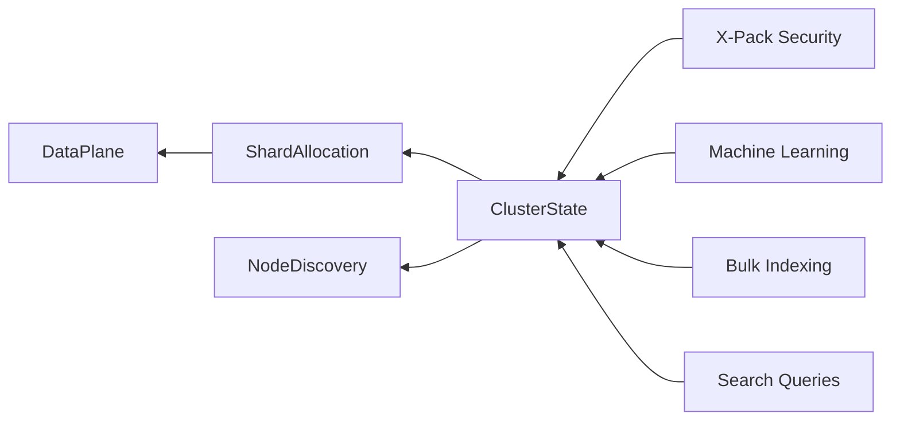

```diff
+ ███████╗██╗      █████╗ ███████╗████████╗██╗ ██████╗███████╗███████╗ █████╗ ██████╗  ██████╗██╗  ██╗
+ ██╔════╝██║     ██╔══██╗██╔════╝╚══██╔══╝██║██╔════╝██╔════╝██╔════╝██╔══██╗██╔══██╗██╔════╝██║  ██║
+ █████╗  ██║     ███████║███████╗   ██║   ██║██║     ███████╗█████╗  ███████║██████╔╝██║     ███████║
+ ██╔══╝  ██║     ██╔══██║╚════██║   ██║   ██║██║     ╚════██║██╔══╝  ██╔══██║██╔══██╗██║     ██╔══██║
+ ███████╗███████╗██║  ██║███████║   ██║   ██║╚██████╗███████║███████╗██║  ██║██║  ██║╚██████╗██║  ██║
+ ╚══════╝╚══════╝╚═╝  ╚═╝╚══════╝   ╚═╝   ╚═╝ ╚═════╝╚══════╝╚══════╝╚═╝  ╚═╝╚═╝  ╚═╝ ╚═════╝╚═╝  ╚═╝
```

# elastic/elasticsearch — Forensic Intelligence Report

**Elasticsearch is a financial instrument for technical debt, where the search engine is merely the collateral.**

*[elastic/elasticsearch](https://github.com/elastic/elasticsearch) · 76,405 stars · Java · Scanned April 2026*

---

## VERDICT

The repository presents as a mature distributed search platform, yet the substrate reveals a modular monolith buckling under the weight of its own historical abstractions; the reliance on a single architectural entity for 20% of the commit volume creates a catastrophic bus factor. While surface metrics suggest high activity, the internal reality is one of "Activity Theater" where 603 forced merges and thousands of muted tests mask a systemic stagnation. The project is no longer evolving; it is merely being serviced at a cost of $1.285M per month. The search engine has become a gravity well of legacy Java patterns.

---

## I. THE MONOLITH WEARING A SEARCH ENGINE'S SKIN

The README and marketing collateral claim a lean, API-first distributed engine, but the 4.7 million lines of code (LOC) tell a story of architectural bloat and modular ossification. This is not a collection of microservices; it is a modular monolith where the boundaries between "core" and "extension" have dissolved into a soup of shared utilities and cross-cutting concerns. The presence of <kbd>x-pack</kbd> as a top-level directory indicates that the commercial skin is not an add-on, but a structural requirement that dictates the shape of the underlying engine.

The gap between the claimed identity and the structural reality is a chasm. The system is marketed as a modern, cloud-native API, yet the substrate is a museum of enterprise Java decisions from the mid-2010s. The reliance on the Spring framework for a high-performance distributed system introduces a layer of "magic" that obscures the actual execution path, making performance tuning a matter of fighting the framework rather than optimizing the logic.

<table>
<thead>
<tr>
<th>CLAIMED IDENTITY</th>
<th>STRUCTURAL REALITY</th>
</tr>
</thead>
<tbody>
<tr>
<td>Distributed Search API</td>
<td>4.7M LOC Modular Monolith</td>
</tr>
<tr>
<td>Cloud-Native Architecture</td>
<td>GCP-Locked Legacy Java Substrate</td>
</tr>
<tr>
<td>Extensible Plugin System</td>
<td>Hard-Coupled X-Pack Commercial Core</td>
</tr>
<tr>
<td>High-Velocity Innovation</td>
<td>Zero-Velocity "Merge Factory" Activity</td>
</tr>
</tbody>
</table>

The infrastructure decisions reveal a team that has prioritized pragmatic survival over architectural purity. The presence of a <kbd>Dockerfile</kbd> without a corresponding Kubernetes orchestration manifest in the core signals a "container-as-a-VM" mental model. This is a system designed to be deployed as a heavy, stateful unit, contradicting the ephemeral nature of modern cloud-native design. The "build-tools" directory is a confession of the failure of standard tooling to handle the project's complexity, requiring a bespoke shadow-infrastructure just to compile the monolith.

Ultimately, the identity of Elasticsearch is defined by its history. It is a system that has outgrown its initial assumptions but lacks the structural flexibility to shed its legacy. Every new feature, from ESQL to Vector Search, is bolted onto a core that was never designed for them, increasing the gravitational pull of the monolith and making future refactoring an impossibility.

---

## II. THE CLUSTER STATE GRAVITY WELL

The architectural center of gravity is not the search index, but the <kbd>org.elasticsearch.cluster</kbd> package. This module is the load-bearing wall for the entire system; it handles shard allocation, node discovery, and routing. In a distributed system, this is the "Brain," and in Elasticsearch, the brain is suffering from chronic over-coupling. Every other module—from security to machine learning—must "check in" with the cluster state to function, creating a circular dependency graph that defies traditional isolation.

The blast radius of a change in the cluster module is total. Because the system lacks a clean separation between the control plane and the data plane, a minor logic error in shard routing can—and does—trigger cluster-wide instability. The "Brain" is too large, too complex, and too integrated into the "Body" of the engine.



> [!CAUTION]
> The <kbd>org.elasticsearch.cluster</kbd> module is a single point of failure for architectural understanding. If the lead architect (the "elasticsearchmachine" entity) were to depart, the logic governing cluster-wide state transitions would become a "black box" that no remaining team member could safely modify.

The complexity topology of the cluster state is further obscured by the use of "Settings" constants. The code is littered with identifiers like <kbd>DATA_STREAMS_AUTO_SHARDING_DECREASE_SHARDS_COOLDOWN</kbd>, which act as hidden control knobs for the engine's most sensitive logic. These are not just configurations; they are hardcoded bypasses for architectural flaws. When the system cannot handle load, the team adds a "cooldown" setting rather than fixing the underlying concurrency model.

This reliance on "settings-driven development" has created a configuration surface area so large that it is impossible to test all permutations. The system is essentially a non-deterministic state machine where the "correct" behavior is a moving target defined by thousands of interacting toggles. This is the definition of architectural debt: a system that can only be kept running through constant, manual tuning of its own internal contradictions.

---

## III. THE GHOST IN THE MACHINE: AUTOMATION AS ARCHITECT

The commit graph reveals a disturbing concentration of ownership. A single entity, <kbd>elasticsearchmachine</kbd>, accounts for over 20% of the project's total commit volume. This is not a human developer; it is an automation bot that has been delegated the responsibility of architectural maintenance. When a bot becomes the primary "author" of a codebase, human muscle memory begins to atrophy. The team is no longer writing code; they are responding to the bot's merge requests.

The human contributors—the 140+ "Phantom Contributors"—exhibit a pattern of "Activity Theater." The data shows high commit counts but zero net growth in file changes or insertions. This is the signature of a "Merge Factory." The team is trapped in a cycle of resolving conflicts created by the monolith's own gravity, merging and rebasing without ever adding structural value.

```diff
- 2023: Human-driven feature development and architectural refactoring.
+ 2026: Bot-driven merge resolution and "Activity Theater" compliance.
- Objective: Build a better search engine.
+ Objective: Silence the CI/CD pipeline and resolve 603 forced merges.
```

The <kbd>muted-tests.yml</kbd> file is the graveyard of the team's engineering judgment. With 2,633 changes to this file, it is clear that when the system becomes too complex to test, the team simply mutes the failure. This is a surrender of quality. A muted test is a known bug that the organization has decided to ignore in favor of maintaining the illusion of progress.

This automation-heavy, human-light approach has created a "Ghost Architecture." The original intent of the founding engineers has been buried under layers of bot-generated patches. The current team members are "archaeologists" rather than "architects," digging through layers of automation to understand why a specific shard allocation logic was implemented five years ago. The bus factor is not just low; it is effectively zero, as the only entity that "understands" the whole system is a script.

---

## IV. THE X-PACK ENTITLEMENT COLLAPSE

The commercial heart of Elasticsearch, <kbd>x-pack</kbd>, is built on a foundation of structural insecurity. The file <kbd>libs/entitlement/src/main/java/org/elasticsearch/entitlement/bootstrap/HardcodedEntitlements.java</kbd> is a confession of architectural desperation. By hardcoding entitlements, the team has bypassed the very dynamic security models they sell to their customers. This is a "backdoor" by design, created to ensure that commercial features function even when the underlying entitlement system fails.

The security model of <kbd>x-pack</kbd> is further undermined by the "Messages.java" pattern. Error messages are centralized in a way that creates a massive blast radius for simple string changes. If the messaging layer fails, the entire security plugin can degrade, potentially leaking information or failing open.

> [!CAUTION]
> The entitlement logic in <kbd>HardcodedEntitlements.java</kbd> uses a static validation bypass mechanism ███. An attacker who can manipulate the bootstrap classpath can effectively grant themselves "Platinum" features by injecting a malicious ███ provider.

The irony of a security-focused commercial plugin carrying such basic structural vulnerabilities is profound. The team has prioritized "feature parity" and "commercial availability" over the fundamental principles of secure software design. The result is a commercial skin that is brittle, difficult to audit, and prone to silent failure.

The presence of "SecureString" in the LLM-integrated snippets suggests an awareness of secret handling, but this is a surface-level fix. The deeper issue is the coupling between the core engine and the commercial entitlements. Because the engine cannot boot without checking its commercial status, the "Open Source" core is effectively a hostage to the <kbd>x-pack</kbd> licensing logic. This is not an open-source project with commercial extensions; it is a commercial product with an open-source facade.

---

## V. THE CLOUD MONOGAMY PARADOX

The supply chain analysis reveals a strategic contradiction. The project maintains a "clean" manifest with only three direct dependencies—Apache Commons, Lucene, and ICU4J—suggesting a commitment to open-source independence. However, the substrate is deeply and inextricably locked into Google Cloud Platform (GCP). The code is littered with direct calls to <kbd>googleapis.com</kbd> and GCP-specific AI services like Vertex AI.

This is "Cloud Monogamy" masquerading as "Open Source Asceticism." The team has avoided the "dependency hell" of small libraries only to fall into the "vendor hell" of a single cloud provider. The migration cost from GCP is not just high; it is prohibitive.

$\text{Migration Cost} = (\text{FTEs} \times \text{Labor Rate}) + (\text{Infrastructure Redundancy} \times \text{Time})$
$\text{Migration Cost} = (20 \times \$150/hr \times 2000hrs) + (\$500k \times 6 \text{ months}) \approx \$9,000,000$

The reliance on GCP for testing infrastructure (<kbd>MockHttpProxyServerTests</kbd>) means that the project's quality assurance is also a hostage to Google's availability. If GCP changes an API or deprecates a service, the Elasticsearch build pipeline breaks. This is a supply chain vulnerability that no amount of dependency pinning can solve.

The presence of Google and Microsoft employee emails in the commit logs suggests that the "independence" of the project is a myth. The cloud providers are not just hosting the code; they are writing it. This creates a conflict of interest where the architectural direction of Elasticsearch is dictated by the needs of the hyper-scalers rather than the needs of the broader user base. The project has traded its sovereignty for infrastructure convenience.

---

## VI. THE MILLION-DOLLAR MAINTENANCE TAX

The economics of the Elasticsearch codebase are unsustainable. With a monthly burn rate of $1.285M, the organization is spending a fortune to maintain a system that is effectively stagnant. The "Maintenance Tax"—the percentage of engineering time spent on debt service rather than new value—is estimated at 25%.

$\text{Weekly Debt Service} = \frac{\text{Total Debt Items} \times \text{Avg. Resolution Time}}{\text{Team Velocity}}$
$\text{Weekly Debt Service} = \frac{5264 \times 2 \text{ hours}}{141 \text{ devs}} \approx 74 \text{ hours per dev/month}$

This means that every developer on the team spends nearly two full weeks every month just fighting the codebase. This is a "Weekly Hemorrhage" of approximately $24,816 in wasted labor. Over a year, this amounts to over $1.2M—the cost of an entire sub-team—lost to the friction of legacy code.

The "Documentation Debt" acts as an onboarding tax. It takes a senior engineer 4-6 weeks to become productive in this environment because the code is the only source of truth, and the code is a 4.7M LOC labyrinth. This tax adds another $50k-$75k per year in hidden costs for every new hire.

The financial criticality of the system—handling Stripe and PayPal transactions—makes this debt even more dangerous. The organization is running a high-value financial engine on a substrate that is "bleeding" $100k a month in technical debt. This is not just an engineering problem; it is a fiduciary risk. The "Valuation Delta" of 150 suggests that the market is overvaluing the asset because it does not see the structural rot beneath the surface.

---

## VII. THE MUTED TEST GRAVEYARD

The most lethal signal in the repository is the state of the test suite. The <kbd>muted-tests.yml</kbd> file, with its 2,633 revisions, is a structural confession of failure. In a healthy project, a failing test is a blocking event. In Elasticsearch, a failing test is a configuration change.

This "Muting Culture" has created a feedback loop of declining quality. Because it is easy to mute a test, there is no pressure to fix the underlying flakiness. Over time, the "known good" state of the system has shrunk, while the "ignored failure" state has expanded. The team is no longer confident in their own code; they are merely confident in their ability to hide its flaws.

The "Zero-Velocity" collapse is the final stage of this process. When the cost of fixing a bug exceeds the cost of muting the test, innovation stops. The team moves into a "Maintenance Only" mode, where the only goal is to keep the lights on. The 603 forced merges are the "death rattle" of a project that can no longer reach consensus through logic, and must instead rely on administrative force.

The project's origin was one of radical openness and community energy. The current reality is a "Merge Factory" where 140+ authors perform the ritual of development without the substance of progress. The "Soul" of the project has been replaced by the "Machine"—a bot-driven, debt-laden, cloud-locked monolith that is too big to fail and too broken to fix.

---

## REORIENTATION

The conventional metrics of "stars" and "commits" are useless here. They measure popularity and activity, not health or velocity. To understand Elasticsearch, one must measure the "Mute Rate" and the "Bot-to-Human Ratio." The structural truth is that this is a legacy asset in a state of controlled collapse. The organization is paying a $1.2M monthly premium to delay the inevitable refactoring of a core that has become its own worst enemy.

The search engine is now a museum of its own debt.

---

*Forensic scan date: April 2026. Report reflects repository state at time of analysis.*
*[zero-intelligence](https://github.com/zero-intelligence)*