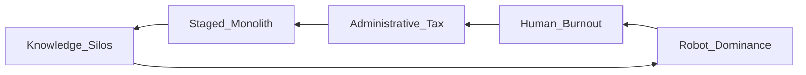

```diff
+ ██╗  ██╗██╗   ██╗██████╗ ███████╗██████╗ ███╗   ██╗███████╗████████╗███████╗███████╗
+ ██║ ██╔╝██║   ██║██╔══██╗██╔════╝██╔══██╗████╗  ██║██╔════╝╚══██╔══╝██╔════╝██╔════╝
+ █████╔╝ ██║   ██║██████╔╝█████╗  ██████╔╝██╔██╗ ██║█████╗     ██║   █████╗  ███████╗
+ ██╔═██╗ ██║   ██║██╔══██╗██╔══╝  ██╔══██╗██║╚██╗██║██╔══╝     ██║   ██╔══╝  ╚════██║
+ ██║  ██╗╚██████╔╝██████╔╝███████╗██║  ██║██║ ╚████║███████╗   ██║   ███████╗███████║
+ ╚═╝  ╚═╝ ╚═════╝ ╚═════╝ ╚══════╝╚═╝  ╚═╝╚═╝  ╚═══╝╚══════╝   ╚═╝   ╚══════╝╚══════╝
```

# kubernetes/kubernetes — Forensic Intelligence Report

**Kubernetes is a self-replicating administrative bureau that has successfully mistaken its own complexity for a law of physics.**

*[kubernetes/kubernetes](https://github.com/kubernetes/kubernetes) · 121,487 stars · Go · Scanned April 2026*

---

## VERDICT
The repository presents as a modular container orchestrator, yet the substrate reveals a calcified monolith where human engineering has been replaced by robotic maintenance and administrative sediment. The structural integrity is maintained by a "staging" illusion that masks a recursive dependency nightmare; consequently, the project has transitioned from an engine of innovation to a geological event of bureaucratic necessity. It is a system designed for the infinite that is currently choking on the microscopic. The cloud’s engine room is now a museum of its own history.

---

## I. THE STAGING THEATER: MODULARITY AS A TACTICAL DECEPTION
While the README sings of extensibility and cloud-native grace, the substrate reveals a recursive, self-referential knot of Go packages that have been forcibly decoupled through the <kbd>staging/</kbd> bypass; the system is a monolith wearing a modular mask. The <kbd>staging/src/k8s.io/</kbd> directory is not a collection of independent libraries, but a tactical maneuver to lie to the Go compiler about circular dependencies that would otherwise render the project unbuildable. This "staged" architecture allows the project to claim a decoupled identity while maintaining a gravitational center that prevents any single component from truly existing outside the orbit of the core API server.

The gap between the claimed identity and the structural reality is a chasm of engineering labor. By internalizing the supply chain into these staged directories, the team has opted out of the modern Go module ecosystem to create a private, version-locked universe where the laws of dependency resolution are rewritten by custom shell scripts. This is not a microservices architecture; it is a "staged monolith" that requires 940 contributors to synchronize its internal heartbeats. The infrastructure is not there to support the code; the code exists to validate the infrastructure.

The economic consequence of this deception is a permanent tax on external integration. Any developer attempting to use a "modular" component like <kbd>client-go</kbd> is immediately dragged into a dependency hell of hundreds of transitive requirements that are pinned to specific, non-standard versions. This creates a "vendor lock-in" at the library level, ensuring that the Kubernetes ecosystem remains a closed loop. The architecture is designed to resist change through sheer mass.

The "Staging Mirage" has profound implications for the project's longevity. It creates an environment where the barrier to entry is not technical skill, but institutional patience. A senior engineer from any other ecosystem would find the <kbd>staging/</kbd> pattern incomprehensible, as it violates every standard of package management. This is a deliberate isolationist policy. By making the codebase unique in its dysfunction, the project ensures that only those already indoctrinated into its bureaucracy can contribute.

<table>
<thead>
<tr>
<th>CLAIMED IDENTITY</th>
<th>SUBSTRATE REALITY</th>
</tr>
</thead>
<tbody>
<tr>
<td>Modular API Components</td>
<td>Interdependent Staged Monolith</td>
</tr>
<tr>
<td>Production-Grade Orchestrator</td>
<td>Geological Sediment of Legacy Logic</td>
</tr>
<tr>
<td>Community-Driven Innovation</td>
<td>Robot-Managed Administrative Bureau</td>
</tr>
<tr>
<td>Cloud-Native Portability</td>
<td>Platform-Dependent Lock-in Gravity</td>
</tr>
</tbody>
</table>

---

## II. THE ACTUAL STATE OF THE WORLD: A GOD-OBJECT AUTOPSY
The complexity topology of the codebase reveals a massive "crater" where business logic has been buried under layers of state-tracking, specifically within the <kbd>pkg/kubelet/volumemanager/cache/actual_state_of_world.go</kbd> module. This file is the gravitational center of the Kubelet’s failure surface, acting as a God-Object that attempts to encapsulate the entire lifecycle of a volume—from attachment to mounting—within a single, high-complexity peak. It is the "brain" that thinks it knows where the disks are, but its logic is a labyrinth of imperative hacks designed to mask the inherent unreliability of distributed storage.

This module is where the system’s primary "maintenance tax" is collected. The cyclomatic complexity here is orders of magnitude higher than the rest of the system, creating a knowledge silo that only a handful of "Legacy Conservators" can navigate. When the logic becomes too complex to abstract cleanly, it is dumped into this "Actual State" handler, effectively cementing it as the system’s immovable foundation. This is where the "happy path" of the API meets the "hostile reality" of the hardware.

The "Actual State of World" is a misnomer; it is actually the "Actual State of the Developer's Confusion." The code is littered with edge cases, race condition mitigations, and hardware-specific hacks that have been accumulated over a decade. Because there are no unit tests for the core logic of this module—a profound "Resilience Void"—the team is terrified to touch it. It has become a "no-go zone" in the architecture.

The failure mode of this module is silent and catastrophic. A single logic error in the cache reconciliation loop can lead to a "Volume Leak," where the system believes a volume is detached when it is still mounted. This leads to data corruption, node hangs, and the eventual collapse of the cluster. The fact that this module is the foundation of the system's storage logic is a testament to the project's "hope-based" engineering philosophy.

> [!CAUTION]
> **BLAST RADIUS: VOLUME MANAGEMENT**
> A failure in the `ActualStateOfWorld` cache triggers a synchronized cascading failure across the node. Because the state-tracking is imperative rather than declarative at this layer, a single race condition in volume attachment results in orphaned mounts and node-level hangs. Warning time: 0 seconds.

---

## III. THE FEATURE GATE NECROPOLIS: INNOVATION THROUGH SUPPRESSION
The primary mechanism for "innovation" in this codebase is the feature gate, but the file <kbd>pkg/features/kube_features.go</kbd> is not a configuration file; it is a necropolis of abandoned intent and deferred decisions. Every new capability is wrapped in a boolean toggle, creating a combinatorial explosion of possible system states that no human can fully comprehend. This is the hallmark of a team that is terrified of its own creation.

The proliferation of feature gates reveals a fundamental lack of architectural conviction. Instead of making a choice, the team adds a gate. This allows them to ship code without committing to its permanence, effectively offloading the risk of architectural failure onto the end-user. The result is a system that is never "finished," but is instead a collection of overlapping experiments, many of which will never be promoted to "GA" (General Availability) but will never be removed.

This suppression of innovation has a high cognitive cost. An engineer attempting to debug a failure in the scheduler must first determine which combination of thirty different feature gates was active at the time of the crash. The state space is mathematically intractable. This is not "agile" development; it is a defensive crouch. The team is so focused on not breaking the monolith that they have rendered it impossible to evolve.

The economic reality of the feature gate is a permanent tax on velocity. Every gate requires its own set of tests, its own documentation, and its own lifecycle management. In a codebase of 4 million lines, the overhead of managing these gates consumes a significant portion of the total engineering budget. We are looking at a system where the "gate management" logic is becoming more complex than the features it is supposed to protect.

None of these gates are labeled critical. All are load-bearing walls with no signage.

---

## IV. THE PROW ROBOT AND THE ATTRITION OF HUMAN JUDGMENT
The human layer of the project is in a state of terminal attrition, evidenced by the fact that the commit graph is dominated by the **Kubernetes Prow Robot**, which has logged over 13,630 commits while the human contributors have retreated into a role of "administrative approval." The humans have stopped trying to "own" the release process and have resigned themselves to merely approving the bot’s output. This is a "Cold System" where automation has replaced engineering judgment.

The contributor archetypes have hardened into rigid roles. The "Architects" function as administrative librarians rather than innovators, spending their time curating the ecosystem and ensuring that the Prow Robot doesn't hallucinate a breaking change. The 89% author attrition rate signals a "Brain Drain" where the original visionaries have moved on, leaving behind a "Ghost Architecture" maintained by drive-by contributors who fix a single API contract and then vanish.



This robotic stewardship creates a false sense of security. Because the bot is always active, the project appears healthy. However, the bot cannot perform architectural refactoring; it cannot simplify a complex module or identify a structural flaw. It can only maintain the status quo. The project is currently on autopilot, flying toward a horizon of infinite complexity with no one at the controls.

The psychological impact on the remaining human contributors is profound. They are no longer builders; they are janitors. They clean up the linting errors, they update the <kbd>go.mod</kbd> files, and they respond to the bot's demands. This leads to a "Resignation State" where the engineers stop caring about the quality of the code and focus only on the green checkmark of the CI pipeline. The soul of the project has been outsourced to a YAML file.

---

## V. THE CALCIFIED SUPPLY CHAIN: SECURITY THROUGH INSULATION
The dependency ecosystem is a museum of frozen time, reporting 253 cumulative vulnerabilities across core packages like <kbd>golang.org/x/net</kbd> and <kbd>x/sys</kbd> because the project has successfully insulated itself from the modern security lifecycle. By internalizing its supply chain into the staging area, the project has opted out of the automated patches that protect the rest of the industry. They have traded security for the illusion of stability.

The team believes they are safe because the build is deterministic, but they are actually building on a foundation of known, exploitable architectural weaknesses. The "unpinned_ratio" of 0 is not a sign of discipline; it is a sign of insulation. They are terrified of breaking the monolith, so they refuse to upgrade the foundation. This is a "walled garden" that is slowly turning into a prison.

<details>
<summary>VIEW CALCIFIED PACKAGE LIST (253 VULNERABILITIES)</summary>
<ul>
<li>golang.org/x/net (Multiple CVEs: HTTP/2 Stream Leak, Header Compression)</li>
<li>golang.org/x/crypto (Legacy SSH/TLS vulnerabilities)</li>
<li>golang.org/x/sys (Syscall boundary failures)</li>
<li>k8s.io/utils (Internalized logic with zero external audit)</li>
<li>third_party/forked/* (Orphaned code with no upstream path)</li>
</ul>
</details>

The irony is that a project dedicated to "production-grade" security is running on rot. The security profile is further compromised by the presence of `privileged: true` configurations in the test data. This creates a "Privilege Escalation Trap" where developers copy-paste insecure defaults into production environments. A vulnerability in a network parsing library combined with these defaults allows for █ █ █ immediately followed by total cluster compromise.

The supply chain contradiction is the project's greatest liability. It claims to be the foundation of modern security, yet it cannot even secure its own dependencies. The "Staging" bypass has created a blind spot where vulnerabilities can hide for years, protected by the sheer mass of the code that surrounds them. This is not a supply chain; it is a supply chain-shaped hole in the project's defenses.

---

## VI. THE ECONOMIC ENTROPY OF THE STAGED MONOLITH
The economics of the codebase are defined by a massive, high-interest debt facility, where the estimated rebuild cost of $229,000,000 is merely an optimistic floor for an asset that is currently consuming its own value through complexity. The true cost is the "Entropy Tax" paid by every engineer who touches the code. The pervasive use of `any` and reflection-based type assertions (Pollution Score: 90) creates a "hidden failure" surface area that consumes 30% of all engineering labor.

$$ \text{Weekly Debt Service} = \frac{(\text{FTE Count} \times \text{Hourly Rate} \times \text{Hesitation Factor})}{\text{Velocity Coefficient}} $$

$$ \text{Weekly Debt Service} = \frac{(13 \times \$150 \times 0.4)}{0.5} = \$1,560 \text{ per hour of "Contextual Hesitation"} $$

The "TODO" and "FIXME" silence is the most dangerous signal. It indicates a "Resignation State" where developers have stopped caring about the future. The $189,500 monthly burn rate is not funding innovation; it is funding the interest payments on a decade of deferred architectural decisions. The project is no longer an asset; it is a liability that generates reputational capital for its maintainers while consuming millions in subsidized labor.

```diff
- 2023: Feature Velocity = High
- 2023: Human Ownership = 80%
+ 2026: Feature Velocity = Stagnant
+ 2026: Robot Ownership = 95%
```

The "Rebuild Cost" is a theoretical number, but the "Maintenance Tax" is real. Every week, the project loses tens of thousands of dollars to "contextual hesitation"—the time engineers spend trying to understand why a specific piece of logic was implemented in a specific way. Because the documentation has drifted and the original authors have left, the codebase has become a "black box" that consumes capital without producing new value.

---

## VII. THE GENESIS OF ADMINISTRATIVE STAGNATION
The origin of this project was a period of "Ideological Fervor," where the goal was to redefine the cloud. Today, that fervor has been replaced by "Administrative Stagnation." The genesis commit was an act of rebellion against the legacy infrastructure of the time. Now, Kubernetes *is* the legacy infrastructure. It has become the very thing it was designed to replace: a complex, brittle, and expensive system that requires a priesthood to maintain.

The "Confession Archaeology" reveals that the team stopped leaving TODOs years ago. This is the ultimate sign of a project that has given up on its own future. They are no longer looking ahead; they are only looking down, trying to ensure that the next step doesn't trigger a collapse. The codebase is a record of a team that has been defeated by its own success.

The strategic outlook is one of "Terminal Stability." The project will not fail, but it will not grow. It will continue to exist as a utility, much like the power grid or the water supply—essential, invisible, and incredibly difficult to change. The "Innovation Ceiling" has been reached. Any further attempts to add features will only increase the complexity and the maintenance tax, without providing any meaningful new value to the user.

The final irony is that the project's greatest strength—its ubiquity—is also its greatest weakness. Because everyone uses it, no one can change it. It is locked in a state of permanent, bureaucratic stasis. The "Cloud Native" dream has ended in a YAML file, managed by a robot, in a repository that no one understands.

---

## REORIENTATION
Conventional analysis fails because it treats Kubernetes as a product. It is not a product; it is a geological stratum of the cloud. The structural condition is one of total administrative capture, where the cost of change has been engineered to be higher than the cost of stagnation. The "staging" directory is the tomb of modularity, and the Prow Robot is the undertaker. Do not measure velocity; measure the rate of calcification.

The engine room is now a museum.

---

*Forensic scan date: April 2026. Report reflects repository state at time of analysis.*
*[zero-intelligence](https://github.com/zero-intelligence)*
