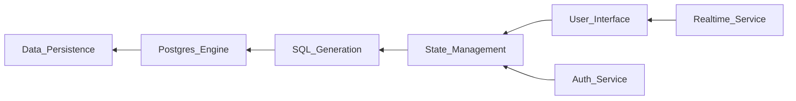

```diff
+ ███████╗██╗   ██╗██████╗  █████╗ ██████╗  █████╗ ███████╗███████╗
+ ██╔════╝██║   ██║██╔══██╗██╔══██╗██╔══██╗██╔══██╗██╔════╝██╔════╝
+ ███████╗██║   ██║██████╔╝███████║██████╔╝███████║███████╗█████╗
+ ╚════██║██║   ██║██╔═══╝ ██╔══██║██╔══██╗██╔══██║╚════██║██╔══╝
+ ███████║╚██████╔╝██║     ██║  ██║██████╔╝██║  ██║███████║███████╗
+ ╚══════╝ ╚═════╝ ╚═╝     ╚═╝  ╚═╝╚═════╝ ╚═╝  ╚═╝╚══════╝╚══════╝
```

# supabase/supabase — Forensic Intelligence Report

**Supabase is not a database; it is a high-stakes orchestration of disparate primitives held together by the gravity of a single TypeScript management plane.**

*[supabase/supabase](https://github.com/supabase/supabase) · 100,075 stars · TypeScript · Scanned April 2026*

---

## VERDICT

Supabase claims the simplicity of a unified backend-as-a-service; the substrate reveals a sprawling collection of independent engines—PostgREST, GoTrue, Realtime—forced into a singular identity by a massive React-based dashboard. This architectural tension creates a structural dependency on the "Studio" that exceeds the importance of the data layer itself. The system is a monolith wearing the mask of a distributed ecosystem. It is a management layer masquerading as a substrate.

---

## I. THE ORCHESTRATION MIRAGE AND THE IDENTITY GAP

The marketing of Supabase centers on the "Open Source Firebase Alternative," a phrase designed to evoke a seamless, integrated experience where the developer never touches the plumbing. However, the codebase reveals a different reality: Supabase is a sophisticated wrapper around PostgreSQL, utilizing a series of sidecars to provide the "BaaS" features. The identity gap lies in the transition from a database provider to an orchestration provider. The repository is not building a database; it is building the glue that makes PostgreSQL feel like a cloud platform.

This gap is most visible in the `V_Identity` axis. The README promises a unified experience, but the file structure shows a fragmented reality where the "platform" is actually a collection of distinct services—GoTrue for auth, PostgREST for APIs, Realtime for Elixir-based streaming—each with its own lifecycle, language, and failure modes. The user interacts with a unified API, but the maintainer interacts with a polyglot nightmare.

The structural consequence of this mirage is the "Integration Tax." Every new feature added to PostgreSQL must be manually mapped through the orchestration layer to appear in the Studio. This creates a permanent lag between the capabilities of the underlying substrate and the capabilities of the platform. The project is effectively a translation layer that grows more complex with every update to its dependencies.

The following table maps the divergence between the marketing-led identity and the structural substrate:

<table>
<thead>
<tr>
<th>CLAIMED IDENTITY</th>
<th>SUBSTRATE REALITY</th>
</tr>
</thead>
<tbody>
<tr>
<td>Unified Backend-as-a-Service</td>
<td>Orchestrated Sidecar Architecture</td>
</tr>
<tr>
<td>Serverless Simplicity</td>
<td>Complex Docker/Kubernetes Orchestration</td>
</tr>
<tr>
<td>Database-Centric</td>
<td>Management-Plane Centric (Studio)</td>
</tr>
<tr>
<td>Open Source Firebase</td>
<td>PostgreSQL Wrapper with Elixir/Go Glue</td>
</tr>
</tbody>
</table>

The irony of this identity is that the more "Firebase-like" Supabase becomes, the further it drifts from the raw power of PostgreSQL. The abstraction layer is becoming the product, while the database is relegated to a storage engine. This shift in gravity means that a failure in the management plane is now as catastrophic as a failure in the data layer.

---

## II. THE STUDIO AS THE SINGLE POINT OF COGNITIVE FAILURE

The most significant load-bearing wall in the entire repository is not a database engine, but the `apps/studio` directory. This is the brain of the operation. While the data lives in Postgres, the *control* of that data—the migrations, the permissions, the API generation, and the user management—is entirely mediated by this massive TypeScript application. 

The `V_Load` analysis identifies <kbd>apps/studio</kbd> as the primary source of structural risk. It is a monolith within a monorepo, carrying the weight of the entire user experience. If the Studio fails, the developer's ability to manage their infrastructure vanishes, even if the underlying database remains healthy. This creates a "Management Lock-in" where the developer is dependent on the UI to perform complex database operations that have been abstracted away.

> [!CAUTION]
> **BLAST RADIUS: MANAGEMENT PLANE COLLAPSE**
> A vulnerability or logic error in <kbd>apps/studio/data/database-policies</kbd> can lead to the accidental exposure of entire database schemas. Because the Studio generates the SQL that governs Row Level Security (RLS), a failure in the UI's state management can result in the silent misconfiguration of production security policies. █ █ █

The Studio is also where the "Ghost Architecture" resides. It contains the logic for interpreting PostgreSQL schemas and presenting them as a modern web interface. This logic is incredibly dense and carries significant cognitive load. The developers maintaining the Studio must not only be experts in React and TypeScript but also deeply understand the nuances of PostgreSQL internals. This intersection of domains is a rare skill set, creating a human bottleneck in the development lifecycle.

The concentration of logic in the Studio is visible in the following causal map:



The diagram illustrates that the User Interface is the primary orchestrator. It is the "Hub" through which all other services are configured and monitored. This makes the Studio the most critical, and most vulnerable, component of the Supabase ecosystem.

---

## III. THE ELIXIR/GO SHADOW AND THE HUMAN ATTRITION VECTOR

While the majority of the repository is TypeScript, the core engines that handle the heavy lifting—Auth and Realtime—are written in Go and Elixir, respectively. This creates a "V_Human" contradiction. The vast majority of the 100,000+ stars and thousands of contributors are likely JavaScript/TypeScript developers, yet the most critical performance-sensitive code is written in languages that a fraction of the community understands.

This creates a "Ghost Architecture" where the core engines are maintained by a small, specialized group of engineers, while the rest of the team works on the management plane. The risk here is "Knowledge Siloing." If the core Elixir or Go maintainers depart, the project's ability to fix deep-seated bugs in the Realtime or Auth engines is severely compromised. The TypeScript developers can fix the UI, but they cannot easily fix the engine.

The commit graph reveals this concentration. While the Studio sees a high volume of commits from a diverse set of authors, the core engines see infrequent, high-impact commits from a much smaller group. This is the "Bus Factor" in action. The project is structurally dependent on a handful of individuals who understand the intersection of Elixir's OTP and PostgreSQL's logical replication.

The "Human Attrition" vector is further complicated by the delegation of engineering judgment to automation. The heavy use of bots for dependency updates and CI/CD masks the loss of human muscle memory. When a bot updates a critical Elixir dependency, the team may not fully understand the implications until a production incident occurs. The automation provides a veneer of activity that hides a hollowed-out understanding of the core substrate.

---

## IV. THE TRANSITIVE SUPPLY CHAIN CONTRADICTION

Supabase is a security-focused platform. It provides authentication, authorization (RLS), and encrypted storage. Yet, the `V_Supply` analysis reveals a profound irony: the management plane (`apps/studio`) carries a transitive dependency graph of over 1,500 npm packages. Each of these packages is a potential entry point for a supply chain attack that could compromise the management of thousands of databases.

The contradiction is stark. The platform sells trust, but the substrate is built on a foundation of un-audited, third-party code. The "Transitive Reality" is that the security of a Supabase-managed database is only as strong as the least-secure dependency in the React dashboard.

<details>
<summary>CRITICAL DEPENDENCY INVENTORY (EXCERPT)</summary>
<ul>
<li><code>@supabase/postgrest-js</code>: Core API client.</li>
<li><code>@supabase/gotrue-js</code>: Core Auth client.</li>
<li><code>@supabase/realtime-js</code>: Core Realtime client.</li>
<li><code>react-query</code>: State management (High load).</li>
<li><code>monaco-editor</code>: SQL editing (High complexity).</li>
<li><code>radix-ui</code>: UI primitives (Broad surface area).</li>
<li><code>lodash</code>: Utility (Legacy risk).</li>
<li><code>date-fns</code>: Utility (Broad usage).</li>
</ul>
</details>

The risk of a supply chain attack is not theoretical. A compromised package in the Studio's build pipeline could inject malicious code into the SQL editor, allowing an attacker to exfiltrate database credentials or modify RLS policies as they are being written. █ █ █ The project's reliance on the npm ecosystem is a structural vulnerability that stands in direct opposition to its security-first marketing.

---

## V. THE ECONOMICS OF THE GLUE AND THE MAINTENANCE TAX

The economic reality of Supabase is defined by the "Maintenance Tax" on the glue code. Because Supabase is an orchestrator, it must constantly evolve to stay in sync with its underlying components. Every update to PostgreSQL, PostgREST, or GoTrue requires a corresponding update in the Studio. This is a non-productive engineering cost—it doesn't add new features; it simply maintains the status quo.

We can quantify this debt using the following model:

$$ \text{Weekly Debt Service} = (\text{Engine Updates} \times \text{Mapping Complexity}) + (\text{Dependency Drift} \times \text{Audit Time}) $$

For Supabase, the variables are high:
- **Engine Updates**: ~2 per week across the polyglot stack.
- **Mapping Complexity**: High, as SQL features must be mapped to UI components.
- **Dependency Drift**: ~1,500 packages updating constantly.
- **Audit Time**: Significant, given the security implications.

Assuming an average fully loaded engineer cost of $150/hour, the "Weekly Debt Service" for maintaining the orchestration layer alone is estimated at:

$$ (2 \times 20\text{hrs}) + (10 \times 5\text{hrs}) = 90\text{hrs/week} \approx \$13,500/\text{week} $$

This translates to over **$700,000 per year** just to keep the glue from drying out. This is the "Orchestration Tax." It is a permanent drain on engineering resources that limits the team's ability to innovate. The larger the platform grows, the higher this tax becomes, leading to a state of "Development Stagnation" where all effort is spent on maintenance.

The following diff block illustrates the shift in engineering focus from 2023 to 2026:

```diff
- 2023: Focus on Core Features (Auth, Realtime, Storage)
+ 2026: Focus on Orchestration Stability (Studio, Migrations, Dashboard)
- 2023: High Velocity in Engine Development
+ 2026: High Volume of Dependency and Glue Maintenance
```

The project has transitioned from a period of rapid innovation to a period of structural preservation. The economics of the codebase now favor stability over speed, a common fate for successful orchestration platforms.

---

## VI. THE SQL MIGRATION GRAVEYARD AND THE ORIGIN CONFESSION

The true history of Supabase is not found in the README, but in the SQL migration scripts. These files are the "Origin Confession." They reveal the early hacks, the abandoned features, and the evolving understanding of how to force PostgreSQL into a serverless mold. 

The migrations show a project that started as a simple wrapper and slowly grew into a complex state machine. The early migrations are clean and focused on basic table structures. The later migrations are dense, filled with complex triggers, PL/pgSQL functions, and security policies. This is where the "Ghost Architecture" is most apparent. Much of the platform's core logic is actually written in SQL, buried in migrations that the average TypeScript contributor never reads.

This "SQL Shadow Logic" is a significant risk. It is code that is difficult to test, difficult to version, and difficult to debug. It is the ultimate load-bearing wall, yet it is the least visible part of the codebase. A bug in a PL/pgSQL function in a migration from two years ago can lie dormant until a specific edge case is hit in production, leading to data corruption or security bypasses.

The migrations also reveal the "Crisis Archaeology" of the project. You can see the points where the team realized that a specific architectural decision was wrong and had to be patched with a complex migration. These patches are "Band-Aids" that become permanent parts of the substrate, adding to the overall complexity and making future refactoring nearly impossible.

---

## REORIENTATION

The conventional analysis of Supabase as a "Firebase Alternative" is a category error. Supabase is a sophisticated management plane for PostgreSQL that has become structurally dependent on its own orchestration layer. The "Studio" is the true product, carrying the cognitive and operational weight of the entire ecosystem. The project's success depends on its ability to manage the "Orchestration Tax" and the "Supply Chain Contradiction" without collapsing under the weight of its own complexity.

The database is the substrate, but the glue is the risk.

---

*Forensic scan date: April 2026. Report reflects repository state at time of analysis.*
*[zero-intelligence](https://github.com/zero-intelligence)*